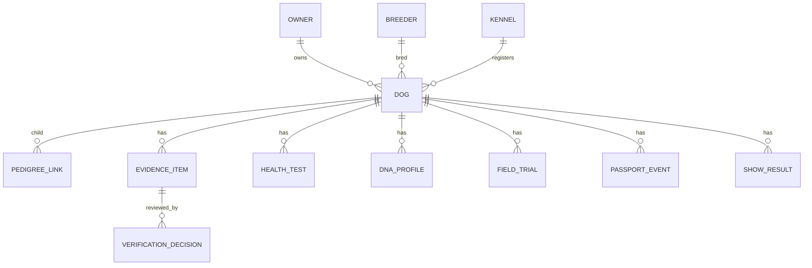

# TAZY.PRO Data Model Draft

This is a domain draft for the MVP. It is intentionally framework-neutral.

## Entity map

## Core entities

### Dog

- `id`
- `registry_number`
- `passport_id`
- `name`
- `sex`
- `date_of_birth`
- `color`
- `region`
- `status`
- `public_profile_slug`
- `verification_level`
- `completeness_score`
- `created_at`
- `updated_at`

### Owner

- `id`
- `display_name`
- `legal_name`
- `country`
- `region`
- `contact_email`
- `contact_phone`
- `public_contact_allowed`
- `consent_version`
- `created_at`
- `updated_at`

Public pages should use `display_name` only unless explicit consent exists.

### Breeder

- `id`
- `display_name`
- `legal_name`
- `country`
- `region`
- `verification_status`
- `public_profile_slug`
- `created_at`
- `updated_at`

### Kennel

- `id`
- `name`
- `registration_number`
- `country`
- `region`
- `owner_id`
- `verification_status`
- `created_at`
- `updated_at`

### PedigreeLink

- `id`
- `child_dog_id`
- `parent_dog_id`
- `parent_role`
- `source`
- `verification_status`
- `created_at`

`parent_role` should be `sire` or `dam`.

### EvidenceItem

- `id`
- `dog_id`
- `type`
- `title`
- `issuer`
- `issued_at`
- `file_id`
- `source_url`
- `hash`
- `visibility`
- `status`
- `created_by`
- `created_at`

Suggested `type` values:

- `pedigree`
- `dna`
- `health`
- `field_trial`
- `show_result`
- `ownership`
- `photo`
- `other`

### VerificationDecision

- `id`
- `evidence_item_id`
- `reviewer_id`
- `decision`
- `reason`
- `created_at`

Suggested `decision` values:

- `approved`
- `rejected`
- `needs_changes`
- `superseded`

### HealthTest

- `id`
- `dog_id`
- `test_type`
- `result`
- `tested_at`
- `issuer`
- `evidence_item_id`
- `visibility`
- `created_at`

### DNAProfile

- `id`
- `dog_id`
- `lab`
- `sample_id`
- `parentage_verified`
- `genetic_markers_summary`
- `evidence_item_id`
- `created_at`

### FieldTrial

- `id`
- `dog_id`
- `event_name`
- `event_date`
- `location`
- `result`
- `video_evidence_item_id`
- `judge_notes`
- `created_at`

### ShowResult

- `id`
- `dog_id`
- `event_name`
- `event_date`
- `country`
- `placement`
- `judge`
- `evidence_item_id`
- `created_at`

### PassportEvent

- `id`
- `dog_id`
- `event_type`
- `title`
- `description`
- `event_at`
- `evidence_item_id`
- `hash`
- `created_at`

Passport events should be append-only after publication.

## Verification levels

Draft 8-level model:

1. Draft profile.
2. Identity data complete.
3. Owner or breeder confirmed.
4. Pedigree source attached.
5. Parentage or DNA evidence attached.
6. Health package attached.
7. Field or show evidence attached.
8. Export-ready FCI profile.

The level should be computed from approved evidence, not manually assigned.

## Completeness scoring

The public score should be separate from verification level. A dog can have a
valid profile but still miss evidence needed for FCI export.

Suggested score groups:

- Identity: 15%.
- Ownership and breeder confirmation: 15%.
- Pedigree depth: 25%.
- DNA and parentage: 15%.
- Health package: 15%.
- Field/show results: 10%.
- Media and public passport readiness: 5%.

## Breeding analytics inputs

Minimum data needed for responsible recommendations:

- Three to five generation pedigree graph.
- Known common ancestors.
- Health-test status for both dogs.
- DNA parentage status.
- Existing offspring count by sire and dam.
- Region and kennel concentration.
- Missing evidence flags.

The first version can show confidence bands instead of pretending to know more
than the data supports.

